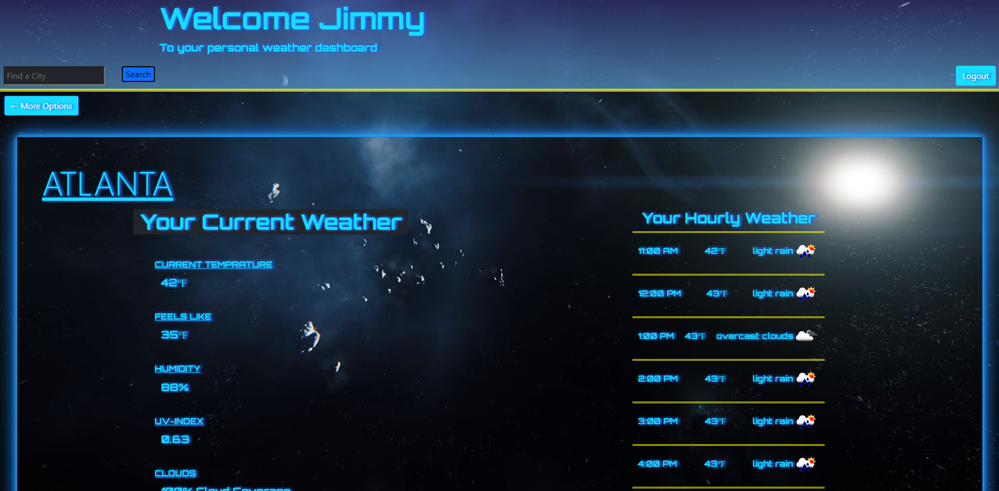

# Weather Dashboard

# What is this?
- This is a recreation of my school project (Weather Dashboard) using many different technologies. The front end of this application will be built using React. The back end of this application will be built using ASP.NET Core. The database for this application will be a azureSQL database and the application will be deployed using azure web services.

- This is essentially a knock off weather app created by your's truly. It is star citizen themed, well because I love space and star citizen. Search a city and get the weather. Lots of implementations missing that will be added eventually. Read further to find out more. 

- Lots of neat features have been added. If you are a potential employer I suggest hitting up the link below and checking it out. I highly suggest creating an account. It can be with random details. Mess around with the features. The offCanvas effect for your previously searched is really cool it thought. I put a lot of work into the suggestions as well. You can see how I did all that on the profile page. I will be adding that to the home page in the future, Many many updates to come. 

# Table of Contents
- [Installation](#installation)
- [Usage](#usage)
- [Credits](#credits)
- [ChangeLog](#ChangeLog)

# Installation
- After I am finsihed creating this application I will give detailed instructions on how to clone and set the repository up for your own application

# Usage
- PLEASE NOTE: If you go to the website and play with the login and registering features there will be delays intially if no one has been using the site. This is because my azureSQL server goes to sleep if it is not being used. This saves me money being that I alone am not spending hundreds or even thousands of dollars on a website built for the purpose of showing employers what I can create. 

- If you click login and nothing happens, just be patient and try again. You may get errors, but it will work. Just wait for the server to wake up

- The routes for updating and deleting are created and work but are not implemented yet

- Jwt delivery is now possible between the front and backend. When a user signs in then a jwt is returned to the user and stored. This token is then used to determine if a user is logged into the application or not which allows for the alteration of the user's experience. The stored user data is very miniscule right now but will be scaled up later once I have more working features and working calls to retrieve the weather. As of right now you can  create an account, login and logout. As far as the regesitration I will need to modify it so there can be no duplicates and minimum password requirements will be set. I will also be including bcrypt into the .NET API for extended security. I've achieved this easily in javascript but never in C# so it may take awhile before I get to that.

- Create an account, login and check your applications local storage which should now include your jwt. You can see how I accomplished that in the Auth.cs, login.jsx and registration.jsx.

- Weather is now displayed upon city search, the data for the city search is now persistent which should lower the API call usage

- Media queries are non existent at this point so if you resize to smaller screens your eyes may fall out of their socket. Aside from that its starting to look better and contain content

- For all of your own testing purposes you will need to create your own appsettings.json file and include your "DefaultConnection" string to your own database. I will later be moving to microsofts built in Secrets.json and will re-include the appsettings.json in this repo

- If you're feeling froggy and want to see what the site looks like in its current state, you can check it out at https://reactweatherapp.azurewebsites.net/. Or just look at the nifty screenshot in here

## Bugs
- Seach time while querying the embedded json is taking quite awhile on the live web page, this was not the case for the development server. I will investigate further into this after I make more progress on main features fo the application
- No media queries yet, resizing the screen will not alter shapes and sizes yet. Will be fixed towards the end of the project
- As of right now if you type in a city that openweathermap does not have data for, the current data will persist for whichever accurate city you previously searched that is stored. I will add prevention and error handling for this when I have time to retrace back to the calls. 

### Contribution/questions
- For anything regarding this category you can email me at SSEPENLOPE23@gmail.com

### Credits
- The UofM Coding Bootcamp for providing follow on courses on C# and .NET which was the baseline for the knowledge I needed to build this

# ChangeLog
- 3/13/23: Made changes to nuget packages that were outdated, causing errors when publishing to azure

- 3/10/23: Added JSON file provided by openweathermap API that contains all major city names, locations, and coordinates. Added a function to call on the C# controller on the backend to return the data and provide suggestions to the user on the front end.

- 3/9/23: Added offCanvas effect to hold all the users stored profile data in the future, I.E. favorited cities and currently holds the users previously searched cities

- 3/6/23: Fixed issue where react would render the previously searched cities twice to the header bar. This was fixed by adding a "if" statement at the top of the function that rendered the componenet to see if the ciities had already been rendered. Check "Header.jsx: 12-13 " if you would like to see how that issue was resolved.